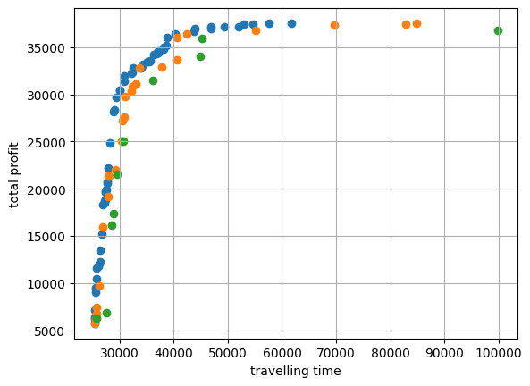

#ECMM409 - Group Coursework
# Non-dominated Sorting Genetic Algorithm II (NSGA-II): The Travelling Theif Problem (TTP)

**Please visit [Github repository](https://github.com/dathd6/GECCO2019---Bi-objective-Traveling-Thief-Competition) to see the README.md in better format**

##About the project
### It's the University of Exeter NIC course group U coursework project. The coursework is to implement a Multi-Objective Evolutionary Algorithms to optimize the Travelling Theif Problem. Our goal is to apply Non-dominated Sorting Genetic Algorithm II (NSGA-II) to a series of experiments and provide solutions to the nine test instances in the competition.
# 

## About the code

- Programming language: Python
- Version: 3.11.5

## Dependencies:
- [matplotlib](https://matplotlib.org)

- [pandas](https://pandas.pydata.org/)
- [numpy](https://numpy.org/)

## File structure:

- [9<u> </u>test<u> </u>problems/](./9_test_problems): Folder (9<u> </u>test<u> </u>problems) contains 9 test problem including problem name, dimension(city number), items number, knapsack capasity, MIN&MAX SPEED, rentting ratio, coordinates of the cities, profit&weight of items and location of items
    + a280-n279.txt
    + a280-n1395.txt
    + a280-n2790.txt
    + fnl4461-n4460.txt
    + fnl4461-n22300.txt
    + fnl4461-n44600.txt
    + pla33810-n33809.txt
    + pla33810-n169045.txt
    + pla33810-n338090.txt
- [evaluation/](./evaluation): Folder (evaluation) contains the evaluation for the competition at GECCO2019.
- [submissions/](./submissions): Folder (submissions) contains The results obtained by each team solving 9 problems, including our team, named TeamU.
- [constant.py](./constants.py): constant variables
- [evolutionary_algorithm.py](./evolutionary_algorithm.py): MOEA class, which contains functions that
    + Extract data from test problem file
    + Method of Generate Initial Population
    + Method of Tournament Selection
    + Method of Crossover for TSP(two-points crossover with fix & ordered crossover)
    + Method of Inversion Mutationfor TSP
    + Method of Single-point Crossover for KNP
    + Method of Inversion Mutation for KNP
    + Method of Non-dominated Sorting
    + Method of Calculate Crowding Distance
    + Method of Elitism Replacement
    + Optimization function
    + Visualize the Front
    + Export Result
    + Local Search for TSP&KNP
- [travelling<u> </u>theif<u> </u>problem.py](./travelling_theif_problem.py): TTP class, which contains functions that
    + Initial the solution
    + Compare solution
    + Calculate weight at varies city 
    + Calculate velocity
    + Calculate fitness of travelling time
    + Calculate fitness of total profit
- [main.ipynb](./main.ipynb): contained the main code to execute MOEA by changing dataset, tournament size generation number on finding the best solution.
- [requirements.txt](./requirements.txt): contained the required packages&libraries the project needs.
- [README.md](./README.md): Documentation for the code

## Getting Strated

####Pull the project source files from GitHub
####Use any programme editor
####Install dependencies
####Follow execution steps below

## Execution
1. Open main.ipynb
2. Run block : Import packages and libraries
3. Go to Main Function and do following changes
	- change the 'test_name' to the dataset you want to solve


		```
			moea = MOEA(test_name='a280-n279')
		```
	- change the 'size<u> </u>p' as the size of population following the the 'LIMI_SOLUTION' in evolutionary_algorithm.py


		```	
		moea.generate_initial_population(size_p=100)
		```

			LIMIT_SOLUTION = {'test-example-n4': 100,
				'a280-n279': 100,
			    'a280-n1395': 100,
			    'a280-n2790': 100,
			    'fnl4461-n4460': 50,
			    'fnl4461-n22300': 50,
			    'fnl4461-n44600': 50,
			    'pla33810-n33809': 20,
			    'pla33810-n169045': 20,
			    'pla33810-n338090': 20,
			}
	- change the 'generations' to how many generations you want to run


		```
			moea.optimize(generations=1000, tournament_size=30, crossover='OX') # Crossover = ['OX', 'PMX']
		```
4. Run block

		moea = MOEA(test_name='a280-n279')
		moea.generate_initial_population(size_p=100)

5. Run block (The following is a demo only, the output of the code you are running may be different)

		moea.optimize(generations=1000, tournament_size=30, crossover='OX') # Crossover = ['OX', 'PMX']
	Get Result:

		Generation:  1
		Generation:  2
		Generation:  3
		Generation:  4
		Generation:  5
		Generation:  6
		Generation:  7
		Generation:  8
		Generation:  9
		Generation:  10
		Generation:  11
		Generation:  12
		Generation:  13
		Generation:  14
		Generation:  15
		Generation:  16
		Generation:  17
		Generation:  18
		Generation:  19
		Generation:  20
		Generation:  21
		Generation:  22
		Generation:  23
		Generation:  24
		Generation:  25
		...
		Generation:  997
		Generation:  998
		Generation:  999
		Generation:  1000
		Output is truncated. View as a scrollable element or open in a text editor. Adjust cell output settings...
6. Run block (The following is a demo only, the output of the code you are running may be different)

		moea.visualize()
	Get result:

	
7. Run block
 
		moea.export_result(dir='submissions', team_name='TeamU')
		[solution.get_fitness() for solution in moea.population]
	Get result:

		[array([32271.93994265, 11600.        ]),
		 array([45208.28790702, 32116.        ]),
		 array([31472.06118101,  7802.        ]),
		 array([33324.52981144, 17438.        ]),
		 array([32589.55657608, 14010.        ]),
		 array([32427.29913364, 12225.        ]),
		 array([32494.65053634, 12407.        ]),
		 array([36922.76616272, 24800.        ]),
		 array([33005.92818987, 16641.        ]),
		 array([40259.34840837, 29749.        ]),
		 array([42773.64152271, 30335.        ]),
		 array([36582.44185967, 24395.        ]),
		 array([32330.12075823, 12096.        ]),
		 array([38495.11997445, 28422.        ]),
		 array([61115.52699804, 32135.        ]),
		 array([30773.92672983,  7185.        ]),
		 array([31579.77618912,  9554.        ]),
		 array([34271.12181816, 18313.        ]),
		 array([31635.55016976, 10726.        ]),
		 array([34456.28237512, 23548.        ]),
		 array([36575.35433384, 24014.        ]),
		 array([33387.73028723, 17517.        ]),
		 array([43179.87015232, 30503.        ]),
		 array([33731.44635809, 18109.        ]),
		 array([33015.47630668, 17123.        ]),
		 array([30303.81302623,  5803.        ]),
		 array([31300.31793423,  7447.        ]),
		 array([36951.40853229, 25664.        ]),
		 array([37517.17201368, 24942.        ]),
		 array([38360.40578622, 25430.        ]),
		 array([37875.68069697, 25065.        ]),
		 array([34241.84342205, 17980.        ]),
		 array([33968.11749871, 17617.        ]),
		 array([31671.66195404, 10038.        ]),
		 array([35895.83160098, 22796.        ]),
		 array([34976.93491512, 20923.        ]),
		 array([34594.61492646, 18903.        ]),
		 array([35038.75480476, 21217.        ]),
		 array([34745.81704139, 19781.        ]),
		 array([31584.38839391,  8838.        ]),
		 array([31038.74079857,  6888.        ]),
		 array([31284.20025892,  7058.        ]),
		 array([38583.04866087, 25953.        ]),
		 array([39220.81796635, 28369.        ]),
		 array([66213.87338658, 32135.        ]),
		 array([38710.63231487, 26140.        ]),
		 array([32412.04893168, 11940.        ]),
		 array([42196.279091, 29127.      ]),
		 array([33179.36958657, 15646.        ]),
		 array([37140.58076011, 24800.        ]),
		 array([32702.16616079, 12662.        ]),
		 array([61322.76626439, 31757.        ]),
		 array([64639.43294414, 32087.        ]),
		 array([32311.69497251, 10744.        ]),
		 array([49574.0814539, 31385.       ]),
		 array([45577.43563533, 30704.        ]),
		 array([48028.19753606, 31228.        ]),
		 array([43438.93251177, 30176.        ]),
		 array([33513.55535377, 17307.        ]),
		 array([31481.87969433,  7802.        ]),
		 array([48070.49830638, 31347.        ]),
		 array([32999.06127894, 13922.        ]),
		 array([33155.78993429, 14885.        ]),
		 array([30824.39696506,  6033.        ]),
		 array([50405.14617808, 31412.        ]),
		 array([46701.33550517, 30851.        ]),
		 array([33573.69022714, 17517.        ]),
		 array([34484.03232014, 18109.        ]),
		 array([35779.95099782, 21878.        ]),
		 array([34192.87186336, 17961.        ]),
		 array([39086.09664844, 26946.        ]),
		 array([57936.30342393, 31439.        ]),
		 array([30479.41056793,  5381.        ]),
		 array([30698.84510933,  5381.        ]),
		 array([39141.95694067, 26462.        ]),
		 array([36782.97691712, 22539.        ]),
		 array([66259.53295904, 32116.        ]),
		 array([59387.81731403, 30900.        ]),
		 array([154726.83132773,  32135.        ]),
		 array([46773.79691019, 29720.        ]),
		 array([41200.4876449, 26776.       ]),
		 array([31419.16306653,  5794.        ]),
		 array([33040.33262384,  9295.        ]),
		 array([32173.11125675,  6274.        ]),
		 array([32644.83704589,  7401.        ]),
		 array([33510.70034173, 12367.        ]),
		 array([31287.05235554,  5593.        ]),
		 array([34436.9971498, 16930.       ])]
8. Go to folder (evaluation) Open evaluation.ipynb
9. Run whole section and Get performance result

##Team Information
####Team U of ECMM409 - Nature Inspired Computation

####Team members:
|Name|Student ID|
| :- | :- |
|DUC DAT HOANG|0000|
|HAOLUN YANG|730017069|
|JOHN PAYNE|680032029|
|DAOLIN YANG||
|JAYASURYA|730048252|
|GAOJIE ZHANG||
|MICHEAL WARRICK||
